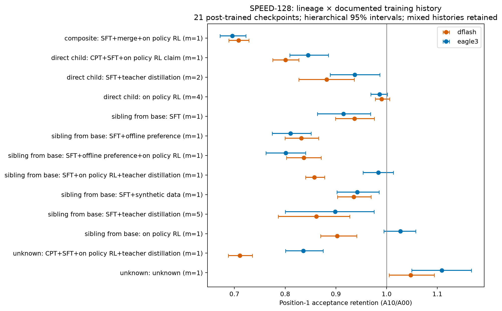

# P1 typed checkpoint population — pilot

2026-10-08, codex-1. The frozen panel contains 25 checkpoints, including two pretrained controls and two previously flagged collapsed GRPO checkpoints. The remaining 21 checkpoints give 42 SPEED-128 comparisons; the eight new checkpoints additionally give 16 MATH-64 comparisons. Every comparison pairs A00/A10 on identical derivative-rendered token IDs, frozen `6da2e42`, vLLM 0.31.0, A40, greedy seed 0, batch 8, 512-token ceiling, EAGLE-3 K4 or native DFlash K. These are convenience-sampled public checkpoints, not a representative estimate of all post-training.

## Evidence and filters

- The card inventory covers all 174 archived atlas and 18 T1 checkpoints, eight expansion checkpoints and one T1b checkpoint: 201 records. Each record retains pinned card URL/hash, evidence lines, lineage, potentially combined training history, and confidence. Forty-five histories remain unknown. Tags and series-level claims are explicitly weaker evidence than a checkpoint-specific recipe.
- Two OpenLearn repositories advertised as Qwen3 have incompatible Qwen2 architecture and no valid matched cells: four candidate comparisons excluded. The 70 candidate pairs therefore yield 66 complete pairs across 25 checkpoints. Four pretrained-control and four collapsed-checkpoint pairs are retained separately, leaving 58 primary descriptive comparisons across 21 checkpoints.
- Nemotron is SFT + on-policy RL + merge; it is not labeled pure teacher distillation. R1-Llama and R1-Qwen start from pretrained bases, so are siblings of the family drafter's instruction target. Tülu SFT, DPO and RLVR retain their different cumulative histories. Skywork has CPT/SFT and an RL claim; Swallow also uses synthetic teacher data. These mixed histories are not pooled into a pure-RL category.
- The archived 174-model/348-pair table remains separate. The later [compatibility and pairing audit](P1-census-pairing-audit-20261008.md) verifies historical generation compatibility and reconstructs its metrics with frozen6da2e42, correcting14 pooled p1 comparisons under D-32. Historical generation commits, prompt-macro versus pooled-step aggregation, and own-domain versus general-fallback workloads remain explicit; these are not new frozen-harness launches.

## Results

The table shows checkpoint-weighted mean first-position retention. Intervals use 5,000 hierarchical draws: sample checkpoints, then paired prompts within each sampled checkpoint. A one-checkpoint interval only reflects prompt uncertainty. Related checkpoints remain correlated; these intervals do not establish causal differences between training recipes.

| Lineage and history | Workload | Checkpoints | EAGLE-3 retention [95% CI] | DFlash retention [95% CI] |
|---|---|---:|---|---|
| Direct child, on-policy RL | SPEED-128 | 4 | .986 [.969, 1.001] | .990 [.978, 1.006] |
| Direct child, SFT + teacher distillation | SPEED-128 | 2 | .937 [.889, .987] | .882 [.827, .936] |
| Direct child, SFT + teacher distillation | MATH-64 | 2 | 1.012 [.994, 1.031] | .879 [.851, .905] |
| Sibling from base, SFT + teacher distillation | SPEED-128 | 5 | .898 [.800, .975] | .862 [.786, .927] |
| Sibling from base, SFT + teacher distillation | MATH-64 | 2 | .904 [.867, .939] | .872 [.809, .939] |
| Sibling from base, on-policy RL (GT-Qwen) | SPEED-128 | 1 | 1.027 [.995, 1.057] | .903 [.870, .941] |

Nulls and exceptions matter: the two direct-child teacher-distilled Qwen checkpoints have no detectable EAGLE p1 loss on MATH-64, despite DFlash loss. GT-Qwen retains EAGLE acceptance but loses DFlash acceptance. The Tülu ladder retains EAGLE p1 at .915 → .810 → .801 and DFlash at .937 → .832 → .837 from SFT through DPO and RLVR; this does not isolate the effect of its last training stage. Nemotron's mixed history gives .696/.708 retention. All other classes, individual checkpoints, lengths and τ remain in the linked machine-readable tables.

## Reproduction

Semantic inventory: `artifacts/P1_typed_20261008_1515/{label.py,refine.py,typed-v2.json,inventory-v2.md}`. Frozen raw-counter analysis: `analyze_v3.py`, `analysis-v3/{results.json,checkpoint-table.md,class-table.md}`. It verifies commit, engine, A40, paired prompt hashes and settings, and reconstructs metrics from per-step counters. Card sources are under `artifacts/P1_population_20261008_0305/`. The T1b verified-weight retry index is applied explicitly. Initial analysis accidentally selected the dedicated oracle as a family A10 and failed its matching assertion; v2 then omitted two successful retry cells. Both attempts are preserved; v3 resolves both issues.

This is a pilot synthesis, with provisional labels where cards are incomplete. No gate, threshold or paper framing was changed.

