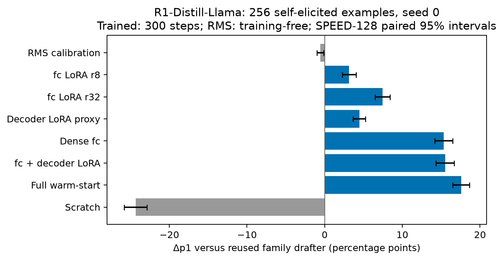

# P3 D48: three seeds and four-target generality

2026-10-08, codex-1. Pilot; the 256-example /300-step extension is complete. Data scaling remains in progress. Acceptance was independently reconstructed from frozen6da2e42/vLLM0.31.0/A40 per-step counters, with identical rendered token IDs across reused/repaired arms. Greedy seed0 evaluation, EAGLE-3 K4, batch8,512-token ceiling. SPEED n128; MATH n64.

## R1-Llama: three training seeds

Seed0 reuses D46; seeds1/2 use the same data, native TTT objective, optimizer and schedule, with compact storage. Each seed matches the fc/full training order and token budget; seed-dependent shuffling can change packing. The table averages the three seeds. Intervals jointly resample seeds and paired queries (10,000 draws); three seeds give only a limited estimate of seed variation. Recovery uses the raw paired dedicated-oracle gap, not rounded constants.

| Arm | Workload | Seeds × queries | Δp1 [95% CI] | Across-seed SD of Δp1 | τ | Δτ [95% CI] | Oracle-gap recovery [95% CI] |
|---|---|---|---|---:|---:|---|---|
| fc | speed128 | 3 × 128 | +0.1518 [+0.1405,+0.1624] | 0.0027 | 2.1286 | +0.3983 [+0.3671,+0.4269] | 35.6% [33.4,37.7] |
| fc | math64 | 3 × 64 | +0.1381 [+0.1245,+0.1505] | 0.0037 | 2.3764 | +0.4288 [+0.3926,+0.4615] | 21.9% [19.8,23.9] |
| full | speed128 | 3 × 128 | +0.1746 [+0.1631,+0.1854] | 0.0016 | 2.2333 | +0.5031 [+0.4685,+0.5349] | 45.0% [42.7,47.4] |
| full | math64 | 3 × 64 | +0.1613 [+0.1481,+0.1742] | 0.0011 | 2.4917 | +0.5441 [+0.5041,+0.5835] | 27.8% [25.5,30.3] |

Individual seed results, per-depth conditional acceptance, lengths, raw/fixed-D46 recovery and data-plus-training costs are retained in the source table. Across these six runs, successful data-plus-training cost is about0.42–0.47 A40 GPU-hours per repair; data generation is included separately for each arm, even though the same sealed data are physically reused. Engineering smokes and evaluation are not included in this per-repair cost.

## Generality at256 examples /300 steps

One training seed per target/arm. All targets use their own self-elicited queries and greedy responses; every new data path passed five full decoded-string and answer-mask reviews. All evaluation prompts, including all MATH500 questions, were excluded from training queries. No dedicated oracle is available for these targets, so no oracle recovery is inferred.

| Target | Arm | Workload | n | Δp1 [paired95% CI] | τ | Δτ [paired95% CI] | Mean output tokens | Data+train GPUh |
|---|---|---|---:|---|---:|---|---:|---:|
| Nemotron | fc | speed128 | 128 | +0.1375 [+0.1274,+0.1478] | 2.2164 | +0.3929 [+0.3654,+0.4199] | 351.7 | 0.331 |
| Nemotron | fc | math64 | 64 | +0.1550 [+0.1456,+0.1643] | 2.4248 | +0.4646 [+0.4389,+0.4895] | 512.0 | 0.331 |
| Nemotron | full | speed128 | 128 | +0.1502 [+0.1387,+0.1617] | 2.2843 | +0.4608 [+0.4276,+0.4946] | 357.5 | 0.355 |
| Nemotron | full | math64 | 64 | +0.1734 [+0.1643,+0.1823] | 2.5244 | +0.5643 [+0.5362,+0.5918] | 512.0 | 0.355 |
| R1-Qwen | fc | speed128 | 128 | +0.0361 [+0.0232,+0.0466] | 2.0759 | +0.1502 [+0.1189,+0.1786] | 503.6 | 0.503 |
| R1-Qwen | fc | math64 | 64 | +0.0274 [+0.0182,+0.0364] | 2.5129 | +0.1514 [+0.1244,+0.1775] | 512.0 | 0.503 |
| R1-Qwen | full | speed128 | 128 | +0.0554 [+0.0415,+0.0669] | 2.1595 | +0.2339 [+0.1994,+0.2655] | 501.7 | 0.525 |
| R1-Qwen | full | math64 | 64 | +0.0395 [+0.0303,+0.0488] | 2.5685 | +0.2069 [+0.1765,+0.2371] | 512.0 | 0.525 |
| GRPO150 control | fc | speed128 | 128 | +0.0122 [+0.0044,+0.0201] | 2.5033 | +0.0977 [+0.0719,+0.1255] | 356.0 | 0.333 |
| GRPO150 control | fc | math64 | 64 | +0.0375 [+0.0287,+0.0463] | 2.8520 | +0.1788 [+0.1491,+0.2069] | 450.2 | 0.333 |
| GRPO150 control | full | speed128 | 128 | +0.0161 [+0.0082,+0.0239] | 2.5387 | +0.1331 [+0.1076,+0.1598] | 356.4 | 0.356 |
| GRPO150 control | full | math64 | 64 | +0.0609 [+0.0511,+0.0707] | 3.0002 | +0.3270 [+0.2864,+0.3671] | 450.9 | 0.356 |
| Hermes3 control | fc | speed128 | 128 | +0.0727 [+0.0535,+0.0901] | 2.4786 | +0.2703 [+0.2196,+0.3194] | 177.4 | 0.336 |
| Hermes3 control | fc | math64 | 64 | +0.0981 [+0.0789,+0.1182] | 2.5823 | +0.3555 [+0.2833,+0.4326] | 270.4 | 0.336 |
| Hermes3 control | full | speed128 | 128 | +0.0764 [+0.0590,+0.0933] | 2.5019 | +0.2936 [+0.2373,+0.3491] | 181.2 | 0.331 |
| Hermes3 control | full | math64 | 64 | +0.0996 [+0.0807,+0.1182] | 2.5689 | +0.3422 [+0.2737,+0.4106] | 257.4 | 0.331 |

Nemotron improves substantially under both scopes; R1-Qwen improves less. The GRPO control has small positive SPEED gains, rather than a null, and larger MATH gains. The well-transferring Hermes control also improves; its selection was explicitly based on prior EAGLE retention, so it is not a random population sample. None of these one-seed transfers establishes population-level generality.

## What remains

The nested self1k/self4k and generic4k runs use one complete epoch and quarter/half/final exports. Generation is running, with four self-query shards and global deduplication before sealing. Query-only capacity is4652 unique admissible queries from4656 candidates, sufficient for4k; responses must still finish. The scaling result, best-scale seeds and best-scale generality are not yet available.

Source: `artifacts/D48_analysis_20261008_1528/snapshot-20261008_154409/results.json`; analyzer `artifacts/D48_analysis_20261008_1528/analyze_v2.py`, with immutable snapshots as cells finish. Matched training audits pass. Data/training/evaluation artifacts: `artifacts/P3_D48_20261008_1455/`. New trainable-only checkpoints and exact shared-shard HF exports preserve the frozen evaluation engine.

P3 component verdict at the current budget: dense fc repair captures a substantial part of full warm-start improvement on R1-Llama and Nemotron; R1-Qwen gains are smaller. This is a description of the measured scopes and targets. It does not establish that all loss is caused by a simple mean/RMS shift, or that interface repair fully closes the oracle gap.

Original seed0 component pilot, retained for comparison (not the three-seed average):

